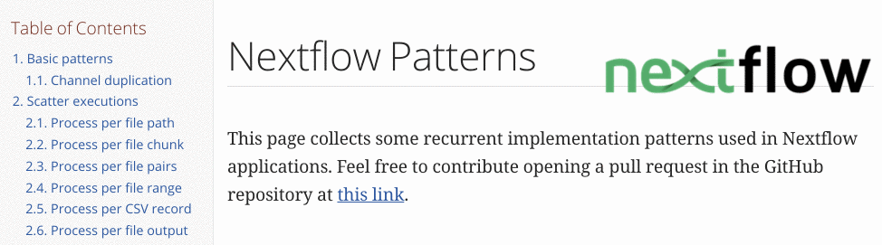
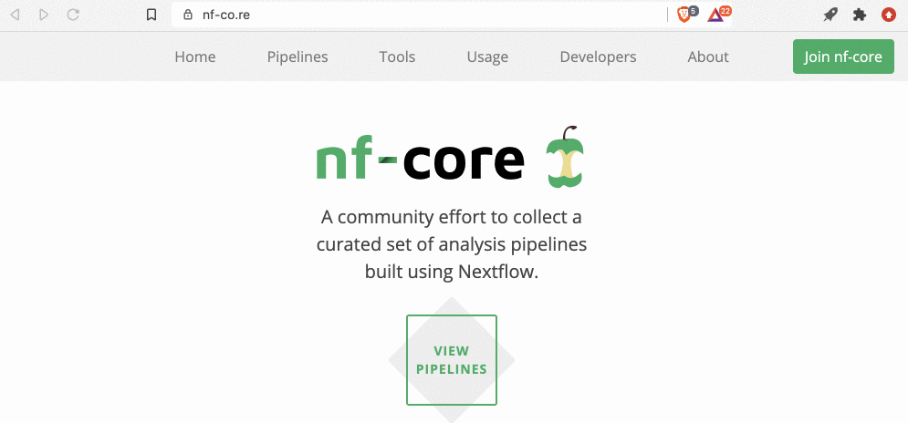

## Nextflow patterns

There is an excellent resource with common Nextflow patterns to integrate in your custom workflows that can be found here:

https://nextflow-io.github.io/patterns/index.html

## The nf-core community and pipelines

There is a community of researchers that are developing and maintaining high quality Nextflow based bioinformatics pipelines, [nf-core](https://nf-co.re/).

